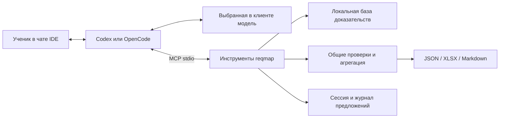

# Агентный слой reqmap для чата IDE

Дата: 2026-10-04

Статус: проект спецификации для ревью пользователем; реализация не начата.

Базовый код: `2ba90afe9e61c1eda22cf1e6a34c9cf508798a5b`.

## 1. Задача и согласованные решения

Пользователь, в том числе школьник, открывает проект в VS Code или PyCharm,
передаёт требование либо файл во встроенном чате и получает объяснённый,
проверяемый результат сопоставления с OpenStack. Рабочие ОС — Linux и macOS.

Codex и OpenCode — агентные клиенты, а не названия используемой языковой модели.
Клиент организует диалог, хранит его контекст и вызывает инструменты; выбранная
в нём модель предлагает разбор требований и сопоставления. reqmap предоставляет
поиск, предметную валидацию и экспорт. В этом режиме reqmap не вызывает LLM API.
Выбор модели и провайдера остаётся в клиенте; отдельный endpoint в конфигурации
reqmap не нужен. Одинаковая физическая модель для всех ходов не навязывается.

Результат этапа — агентный рабочий процесс поверх существующего движка, общий
для двух клиентов. Самостоятельный агентный runtime внутри reqmap не создаётся.

Пользовательский сценарий:

1. Ученик выбирает агента в чате IDE и просит проанализировать текст или файл.
2. Агент уточняет только недостающие условия и показывает выбранный профиль.
3. Агент получает исходные строки через reqmap, предлагает атомарные требования,
   запрашивает контекст доказательств и предлагает сопоставления.
4. reqmap проверяет предложения. Агент исправляет ошибки либо объясняет пробелы.
5. reqmap формирует согласованные JSON, XLSX и Markdown, журнал и manifest.
6. Агент сообщает статус, незавершённые требования, ограничения и ссылки на файлы.

Прямой `reqmap analyze` с собственной конфигурацией LLM сохраняется как отдельный
совместимый режим. Автоматического переключения между режимами при ошибке нет.

## 2. Подход и границы

Выбран локальный MCP-сервер по stdio и общий skill рабочего процесса.
MCP передаёт структурированные запросы и ответы, а предметные решения проверяет
общий Python API reqmap. Альтернатива «только skill над CLI» проще по транспорту,
но требует разбирать файлы и текст команд между шагами. Отдельный агент внутри
reqmap дублировал бы runtime клиента и потребовал собственную настройку модели.

В этап входят оба существующих профиля: `legacy` и `deep`. Для `deep` остаются
обязательными approved signed snapshot v2, внешний `allowed_signers` и проверка
доверия. Наличие агентного слоя не означает наличия production deep corpus.
macOS как ОС ученика не меняет Rocky Linux 9 как анализируемый host OS profile.
Базовый OpenStack — 2025.1; переход к 2026.1 допустим только в существующем
upgrade profile с раздельными версиями источника и назначения.

В этап не входят новые корпуса, поиск доказательств в Интернете, выполнение
инфраструктурных команд, собственное расширение IDE, HTTP-сервер и общий сервис
для нескольких пользователей. Backend не обращается к сети; доступ к модели
организует клиент и он может требовать сеть. Автономность backend не означает
автономность облачной модели.

## 3. Подключение к IDE

Матрица целевых маршрутов основана на официальной документации, проверенной
2026-10-04. Это основание для реализации, а не свидетельство выполненных тестов.

| IDE и клиент | Поверхность диалога | Цель первой приёмки |
| --- | --- | --- |
| VS Code + Codex | Чат расширения Codex | Да |
| PyCharm + Codex | Codex в JetBrains AI Chat | Да |
| PyCharm + OpenCode | JetBrains AI Chat через ACP | Да |
| VS Code + официальное расширение OpenCode | Терминальный интерфейс | Не удовлетворяет выбранному требованию о встроенном чате |

Маршруты Codex описаны в [документации IDE-интеграции](https://learn.chatgpt.com/docs/codex/ide)
и [JetBrains Codex](https://www.jetbrains.com/help/ai-assistant/codex-agent.html).
Маршрут OpenCode в PyCharm основан на [поддержке ACP](https://opencode.ai/docs/acp/)
и [JetBrains ACP](https://www.jetbrains.com/help/ai-assistant/acp.html).
Терминальный способ работы официального расширения VS Code указан в
[OpenCode IDE](https://opencode.ai/docs/ide/).

Для Codex поставляется пример project config MCP; для OpenCode — пример
`opencode.json` с локальным сервером. В PyCharm инструкция показывает передачу
custom MCP servers выбранному агенту. Для каждого маршрута используется один
способ регистрации сервера, чтобы инструменты не дублировались. Основания:
[Codex MCP](https://developers.openai.com/codex/mcp),
[OpenCode MCP](https://opencode.ai/docs/mcp-servers/),
[JetBrains MCP](https://www.jetbrains.com/help/ai-assistant/mcp.html).

Общий skill остаётся в `.agents/skills/reqmap/SKILL.md`; поддержка этого пути
OpenCode описана в [Agent Skills](https://opencode.ai/docs/skills/). В случае
отсутствия автоматической загрузки инструкция даёт явный запрос прочитать skill.
Краткие server instructions также описывают обязательный порядок работы, но
ни skill, ни server instructions не заменяют серверную валидацию.

## 4. Конфигурация и поставка

Новая команда: `reqmap agent serve --config /absolute/path/config.agent.yaml`.
Процесс запускается MCP-клиентом, отдельно держать терминал с сервером не нужно.

`config.agent.example.yaml` и отдельный тип конфигурации содержат профиль,
knowledge path, параметры доверия, `top_k`, input profile, разрешённый input root,
session root и output root. Относительные пути разрешаются относительно config.
Поля `model`, API URL и ключи в этой конфигурации не допускаются. Профиль и корни
не могут произвольно меняться аргументами инструментов. Старый AppConfig и его
требование настроить модель для `analyze` сохраняются.

Установка reqmap сохраняет Python >= 3.11 и переносимый offline wheel bundle.
Транспорт реализуется небольшим модулем на стандартной библиотеке Python с
ограниченным набором возможностей MCP. Новые runtime-зависимости и платформенные
wheels не добавляются. Это осознанный обмен: переносимая установка сохраняется,
но совместимость протокола становится обязанностью проекта и требует отдельных
протокольных тестов и проверок настоящими клиентами.

Для ученика поставляются готовые примеры настроек с абсолютными путями, проверка
видимости инструментов и один короткий учебный запрос. Установка IDE и клиента,
вход у выбранного провайдера и установка reqmap описываются отдельными шагами.
Ученику не предлагается получать второй API-ключ специально для reqmap.

## 5. Предметный API без вызовов модели

Из существующего кода выделяются публичные операции подготовки контекста и
приёма предложения. Они используются и прежним pipeline, и агентным режимом:

| Операция | Существующий источник правил |
| --- | --- |
| Разбор input, координаты и стабильные IDs | Текущие input loaders и `ids.py` |
| Проверка атомов и построение canonical atoms | `decomposition_violations`, `build_atoms` |
| Контекст и проверка legacy mapping | `mapping.py`, `retrieval.py` |
| Контекст и проверка deep mapping | `deep_mapping.py`, `deep_retrieval.py` |
| Ответственности, процедуры и агрегация | Существующие deep validators и `procedure.py` |
| Публикация и согласованность | Текущие exporters, manifest и crosschecks |

MCP-адаптер не импортирует приватные функции как свой постоянный API и не копирует
предметные правила. Старые функции с `JsonModel` используют те же выделенные
проверки; их политика повторов и результаты сохраняются регрессионными тестами.

Каждое предложение проверяется по точному атомарному тексту, фиксированному
snapshot, профилю и выданному backend набору кандидатов. Backend назначает IDs,
пересчитывает допустимые статусы, восстанавливает конфликтующие свидетельства
и строит процедуры только из разрешённых шаблонов. Переданный агентом статус —
заявка на проверку, а не готовый canonical результат.

Точная цитата и правильная структура не доказывают семантическую полноту разбора.
Исходное требование сохраняется целиком; качество выделения обязательств
оценивается отдельно на контрольных примерах с настоящей моделью.

## 6. Инструменты и контракт предложений

Версия прикладного контракта — `1.0`. Инструменты принимают строгие JSON objects,
отклоняют неизвестные поля и возвращают типизированные данные и диагностику.
Mutating calls требуют `request_id` и `expected_revision`; создание сессии
требует только `request_id`. Read-only calls возвращают текущую revision.

| Инструмент | Назначение и существенные аргументы |
| --- | --- |
| `reqmap_start_session` | Вход: массив текстов либо путь TXT/XLSX внутри input root; optional уточнения и `parent_session_id`. Проверяет input/KB и фиксирует snapshot. Возвращает session ID, revision, профиль и число строк. |
| `reqmap_get_session` | Session ID, cursor, page size. Возвращает исходные строки, IDs, прогресс, ошибки и незавершённые шаги; фильтр по requirement ID позволяет читать конкретную строку. |
| `reqmap_submit_atoms` | Session ID, requirement ID и полный список предложенных atoms для строки. Проверяет цитаты и обязательные поля, возвращает canonical atoms либо нарушения. |
| `reqmap_get_atom_context` | Session ID и atom ID. Возвращает candidate context, schema предложения и `context_id`, вычисленный backend. |
| `reqmap_search_knowledge` | Session ID, запрос, cursor. Выполняет ограниченный read-only поиск в зафиксированной локальной KB; результаты явно помечены как discovery. |
| `reqmap_get_evidence` | Session ID, evidence ID, cursor. Возвращает запись, provenance и ограниченные фрагменты; произвольного чтения файлов нет. |
| `reqmap_submit_mapping` | Session ID, atom ID, `context_id` и mapping proposal по legacy/deep schema. Возвращает проверенный результат, понижения статусов и диагностику. |
| `reqmap_finalize` | Session ID, `allow_partial` (по умолчанию false). Повторно проверяет состояние, агрегирует и публикует отчёт. |
| `reqmap_get_result` | Session ID, cursor. Возвращает статус, summary, hashes и пути реально опубликованных файлов; до публикации — состояние без ссылок на несуществующие отчёты. |

Proposal schemas сохраняют нынешние поля ответов decomposition/legacy/deep.
Контекст инструмента сообщает правила этапа и точную схему, а не требует
угадывать их по ошибкам. Нельзя передавать целый готовый RunResult, собственные
evidence records или произвольные procedure steps в обход этих контрактов.

`context_id` связан с atom content hash, KB hash, профилем, версией правил и
параметрами retrieval. Контекст воспроизводимо вычисляется сервером. Discovery
не расширяет автоматически допустимый набор evidence для mapping. Ссылка вне
выданного набора отклоняется; агент сообщает ограничение покрытия. Изменение
`top_k` или профиля требует новой сессии с явной конфигурацией.

Уточнения сохраняются отдельно от исходных требований и не являются evidence.
Если после старта уточнение меняет интерпретацию или сам текст, агент создаёт
новую сессию с ссылкой на предыдущую. В первой версии нет скрытого редактирования
исходных строк и сложного слияния нескольких ветвей анализа.

## 7. Состояние, повторы и восстановление

Сессия имеет серверный UUID, immutable input snapshot и его hash, идентификатор
и hash KB, профиль, versioned журнал предложений и монотонную revision. Состояния:
`active`, `finalized`, `failed`. Закрытие чата оставляет активную сессию доступной
для продолжения по ID; отдельного фонового вызова модели нет.

Принятое предложение атомов заменяет весь разбор одной строки и инвалидирует
её mapping results. Принятое mapping proposal заменяет результат одного атома.
Ошибочное предложение не удаляет ранее принятый результат. Финализированная
сессия неизменяема; новый анализ связывается с ней через `parent_session_id`.

Одинаковые `request_id` и payload возвращают сохранённый ответ даже после
перезапуска. Повтор того же ID с другим payload отклоняется. Stale revision
возвращает `REVISION_CONFLICT` без изменения canonical состояния. Проверка
идемпотентного повтора предшествует проверке revision. Ошибки попыток также
журналируются; исправленное предложение получает новый request ID.

Запись состояния атомарна; lock одной сессии защищает от двух процессов IDE.
На диске хранится принятый input и предложения, а производные статусы при
восстановлении проверяются заново. Повреждение журнала, смена KB hash или
несовместимая версия схемы приводят к явной ошибке без продолжения по частично
доверенному состоянию. Hash обеспечивает обнаружение повреждений, но не
криптографическую защиту от владельца локальных файлов.

При неопределённом результате вызова после разрыва связи клиент повторяет его
request ID либо читает сессию. Отмена/таймаут не считаются откатом уже принятой
транзакции. При экспорте используется временный каталог; файлы становятся
публикуемым результатом только после crosscheck и фиксации manifest. Сбой между
публикацией и ответом разрешается повтором finalize, без второй копии отчёта.

## 8. Транспорт и ограничения доступа

Сервер реализует stdio JSON-RPC с согласованием версий `2025-06-18` и
`2025-11-25`, `initialize`, `notifications/initialized`, `ping`, `tools/list` и
`tools/call`. Объявляется только capability `tools`; sampling, resources,
elicitation, prompts и tasks не используются. Клиент с другой версией получает
поддерживаемую версию по процедуре negotiation. Основание —
[MCP lifecycle](https://modelcontextprotocol.io/specification/2025-11-25/basic/lifecycle).

UTF-8 сообщения разделяются переводами строк. stdout содержит только протокол,
stderr — диагностику. EOF завершает процесс с сохранением принятых транзакций.
См. [stdio transport](https://modelcontextprotocol.io/specification/2025-11-25/basic/transports).
Tool results содержат `structuredContent` и соответствующее текстовое JSON
представление. Предметные ошибки возвращаются через `isError`; ошибки JSON-RPC
отделены от них. См. [MCP tools](https://modelcontextprotocol.io/specification/2025-11-25/server/tools).

Ограничения по умолчанию: input file до 25 MiB, до 10 000 требований, до 64 atoms
в одном требовании, RPC frame до 2 MiB, ответ до 512 KiB, страница до 50 записей.
При превышении инструмент возвращает явную ошибку; исходный текст и обязательные
поля не обрезаются молча. Большие наборы читаются постранично, а не включаются
целиком в контекст модели. Настраиваемые лимиты проверяются при старте сервера.

Input — обычные файлы под разрешённым корнем. Проверяются traversal, symlink
escape и специальные файлы. Session/output каталоги назначаются сервером внутри
своих корней; аргумента произвольного output path нет. Исходный XLSX не меняется.
KB доступна только для чтения. Инструментов shell, OpenStack API, Ansible и
управления host OS сервер не предоставляет.

Текст требований и источников считается данными, даже если содержит инструкции
для агента. Проверки backend нельзя отключить таким текстом. Наличие у самого
клиента других инструментов не делает их частью reqmap; этот сервер не является
песочницей всего IDE-агента.

## 9. Публикация, статусы и происхождение результата

Сохраняется комплект: `result.json`, `result.xlsx`, `report.md`, `run.jsonl`,
`manifest.json`. Canonical JSON остаётся источником для производных отчётов.
Готовые артефакты перечитываются и проходят существующие crosschecks.

Finalize без `allow_partial` отклоняет незавершённый анализ и возвращает missing
IDs. Явный частичный экспорт сохраняет все исходные строки. Необработанные строки
и атомы получают существующее состояние `skipped` без вымышленного support
status. `allow_partial` разрешает также существующие deep gaps/conflicts, если
они приводят к `PARTIAL`. Итоговый `SUCCESS`, `PARTIAL` или `FAILED` вычисляется
общими правилами. `SUCCESS` означает завершённость анализа, а не подтверждение
всех требований. Нулевое число строк не даёт успешного пустого отчёта.

Ошибки входа и trust preflight не создают активную сессию: возвращаются код и
диагностика. Ошибка export/crosscheck не допускает успешной выдачи файлов и
фиксирует `failed`; доступна диагностика реально сохранённых артефактов.

В metadata вводится optional allowlisted объект `analysis_origin`. Для нового
режима он обязателен и содержит `mode=external_agent`, `session_id`, revision,
`tool_contract_version`, `workflow_version`, hash журнала предложений и
`reported_client`. Optional `reported_model` записывается только как заявление
клиента с `identity_verified=false`; backend не может доказать, какая модель
в действительности сформировала ответ. При смене модели сведения сохраняются
в записях соответствующих предложений, а общий model label — `external-agent`.
Backend не приписывает себе управление seed: `seed=null`; endpoint отсутствует.

Это additive расширение metadata схем результатов 1.0/2.0 для агентного режима;
предметные поля и статусы не меняются. `OUTPUT_SCHEMA.md`, строгие валидаторы,
manifest и crosschecks получают явное описание нового варианта. Старый режим
сохраняет прежний формат. Совместимость сторонних строгих потребителей нового
optional поля не предполагается без проверки.

В журнал входят явные уточнения, структурированные предложения, ошибки и
инструментальные события. Полная история чата, скрытые рассуждения, API-ключи
и настройки авторизации провайдера не запрашиваются. Повторное проигрывание
журнала проверяет обработку сохранённых предложений; оно не доказывает
повторяемость новой генерации моделью.

## 10. Изменение прежнего клиентского контракта

После реализации обновляются `CLIENTS_CODEX_OPENCODE.md`, общий skill,
`BEGINNER_GUIDE.md`, README, runbook и описание схемы. Прежний запрет клиенту
самостоятельно предлагать mapping явно заменяется двумя режимами:

- `analyze`: клиент запускает существующий pipeline, не подменяя его выводы;
- agent mode: клиент предлагает атомы и mappings через инструменты, а публикует
  только принятый backend результат.

Запрет исполнения инфраструктурных процедур сохраняется. Устаревший общий
запрет «не запускать MCP» заменяется запретом инфраструктурного исполнения.
Примеры старого CLI остаются рабочими и явно требуют отдельной настройки модели.

Skill объясняет уточнения, работу с ошибками, проверку progress и завершение.
После двух отклонений одного предложения агент прекращает автоматические
повторы, показывает ошибку и предлагает осознанное уточнение или частичный итог.
Это политика рабочего процесса, а не доказательство соблюдения со стороны LLM.
Агент не объявляет незавершённый разбор отчётом и не скрывает предупреждения.

## 11. Критерии приёмки

| Уровень | Обязательное свидетельство |
| --- | --- |
| Регрессия | Весь текущий suite проходит; прежний CLI использует общие проверки без изменения результатов. |
| Предметный API | Одни и те же proposals через pipeline и tools дают одинаковые canonical outcomes; неизвестные IDs, чужие цитаты, неверные версии, runnable steps и скрытые конфликты не проходят в обход прежних правил. |
| Отсутствие второго LLM | В агентном режиме не создаётся `OpenAICompatibleClient`, не требуется model config и не выполняются API-вызовы; scripted MCP flow проходит с отключённой сетью. |
| Сессии | Повтор запросов, stale revision, два процесса, смена KB, повреждение состояния и разрыв связи при экспорте имеют проверяемое поведение без потерянных строк и ложного SUCCESS. |
| Протокол | Обе заявленные версии проходят initialize/list/call/error/EOF; stdout остаётся JSON-RPC; реальные клиенты обнаруживают и вызывают инструменты. |
| Отчёты | Текст, TXT и XLSX проходят полный путь; source workbook неизменна; пять файлов согласованы; partial явно показывает незавершённые строки и deep gaps. |
| Переносимость | Offline установка и scripted MCP flow проходят на Linux/Python 3.11 и macOS; wheel audit не допускает новых platform-specific зависимостей. |
| Масштаб | Набор минимум из 1950 требований проходит импорт, pagination, сохранение и финализацию с контролируемым scripted proposer; это не выдаётся за замер качества или стоимости LLM. |
| Чат IDE | Для трёх целевых маршрутов записаны версии IDE/клиента, ОС, provider/model label, видимость skill/tools и успешный анализ учебного требования. Linux и macOS представлены в общей матрице запусков. |
| Качество агента | Зафиксированные контрольные примеры с множественными обязательствами, неоднозначностью, отрицательными evidence и конфликтами проходят с настоящим агентом; пропуски и отклонения публикуются отдельно от результатов unit tests. |

Проверки протокола и scripted proposer не заменяют работу настоящей модели.
Проверка одного клиента не доказывает совместимость другого. Если IDE либо
провайдер недоступны, соответствующий маршрут отмечается как непроверенный и
не объявляется готовым для школьного запуска.

Backend гарантирует применение реализованных правил к принятым предложениям
и согласованность файлов. Он не гарантирует полноту KB, безошибочность
семантического разбора и отсутствие галлюцинаций в свободном тексте чата.
Поэтому финальный ответ агента должен ссылаться на canonical результат и
отличать подтверждённые выводы от пробелов и предположений.

## 12. Следующий этап

После ревью этой спецификации составляется план реализации с отдельными задачами
для общего предметного API, сессий, транспорта, интеграции клиентов и приёмки.
Этот документ не означает, что агентный слой уже реализован или опубликован.
